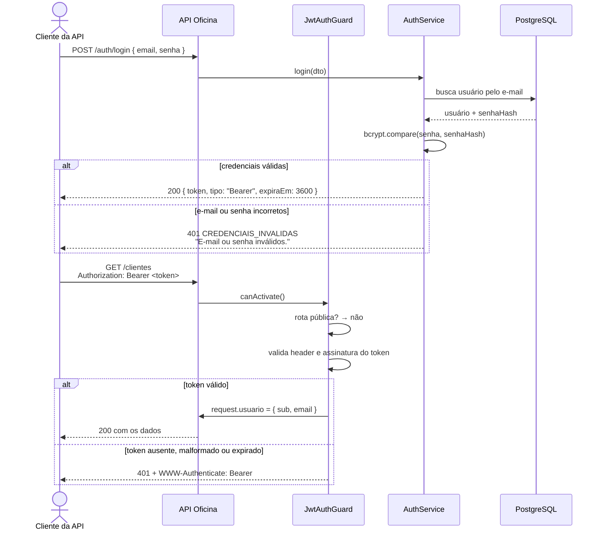

# Autenticação

A API é protegida por **JWT**. Toda rota exige o header
`Authorization: Bearer <token>`, exceto duas exceções declaradas
explicitamente: `POST /auth/login` e `GET /health`.

## Visão geral do fluxo



## Como obter e usar o token

```bash
# 1. login
curl -s -X POST http://localhost:3000/auth/login \
  -H 'Content-Type: application/json' \
  -d '{"email":"admin@oficina.com","senha":"123456"}'
# { "token": "eyJhbGciOi...", "tipo": "Bearer", "expiraEm": 3600 }

# 2. use o token nas demais chamadas
curl -s http://localhost:3000/clientes \
  -H "Authorization: Bearer eyJhbGciOi..."
```

No **Swagger** (`/docs`): execute `POST /auth/login`, copie o valor de `token`,
clique em **Authorize** no topo da página, cole o token e confirme. A opção
`persistAuthorization` está ativa, então o token sobrevive a um recarregamento
da página.

No **REST Client** (arquivos em `requests/`): execute a requisição `Login` (a
primeira de cada arquivo, marcada com `# @name login`) e as demais reaproveitam
o token com `{{login.response.body.token}}`.

## Formato do token

JWT assinado em **HS256**, com três partes separadas por ponto
(`cabeçalho.payload.assinatura`). O payload carrega o mínimo necessário:

```json
{
  "sub": 1,
  "email": "admin@oficina.com",
  "iat": 1790000000,
  "exp": 1790003600
}
```

| Claim   | Significado                                            |
| ------- | ------------------------------------------------------ |
| `sub`   | Id do usuário (*subject*), usado por `GET /auth/me`    |
| `email` | E-mail do usuário, para identificação em logs           |
| `iat`   | Momento da emissão (segundos desde a epoch)             |
| `exp`   | Momento da expiração (segundos desde a epoch)           |

O token **não** contém a senha, o hash da senha ou qualquer dado de negócio.

### Expiração

Controlada pela variável `JWT_EXPIRES_IN` (padrão **`1h`**). Aceita um número de
segundos ou um número seguido de `s`, `m`, `h` ou `d` — por exemplo `3600`,
`30m`, `1h`, `7d`. O campo `expiraEm` da resposta de login é derivado das claims
`exp - iat` do próprio token, então ele nunca discorda da validade real.

O segredo de assinatura vem de `JWT_SECRET`, que precisa ter **no mínimo 32
caracteres** — a aplicação não sobe se isso não for respeitado
(`src/config/env.validation.ts`).

## Rotas públicas

| Método | Rota          | Por quê                                              |
| ------ | ------------- | ---------------------------------------------------- |
| POST   | `/auth/login` | É onde o token é obtido; exigir token seria circular |
| GET    | `/health`     | Monitoramento e *health check* de infraestrutura     |

`/docs` e `/docs-json` também respondem sem token: a documentação é servida como
middleware, fora do alcance do guard.

Qualquer rota nova nasce **protegida**. Liberar exige o decorator `@Public()`
explicitamente — a escolha é sempre visível no código.

## Erros 401

Todas as respostas 401 seguem o [padrão de erro](./erros.md) e acompanham o
header `WWW-Authenticate: Bearer`.

| Situação                                          | `erro`                  | `mensagem`                                                     |
| ------------------------------------------------- | ----------------------- | -------------------------------------------------------------- |
| Header `Authorization` ausente                    | `NAO_AUTENTICADO`       | `Token de autenticação não informado.`                         |
| Header fora do formato `Bearer <token>`           | `TOKEN_INVALIDO`        | `Formato do token inválido. Use: Authorization: Bearer <token>.` |
| Token malformado ou com assinatura inválida        | `TOKEN_INVALIDO`        | `Token inválido.`                                              |
| Token expirado                                     | `TOKEN_INVALIDO`        | `Token expirado. Faça login novamente.`                        |
| Usuário do token não existe mais                   | `TOKEN_INVALIDO`        | `O usuário deste token não existe mais. Faça login novamente.` |
| E-mail inexistente **ou** senha errada no login    | `CREDENCIAIS_INVALIDAS` | `E-mail ou senha inválidos.`                                   |

### Por que a mensagem do login é sempre a mesma

Responder "e-mail não cadastrado" entregaria a lista de usuários a quem está
tentando adivinhar. Por isso os dois casos devolvem **exatamente** o mesmo
corpo — e o serviço ainda executa um `bcrypt.compare` contra um hash fixo quando
o e-mail não existe, para que o **tempo de resposta** também não revele a
diferença.

## Usuário criado pelo seed

| E-mail              | Senha    |
| ------------------- | -------- |
| `admin@oficina.com` | `123456` |

A senha é gravada com bcrypt (10 rounds) em `usuarios.senha_hash`; o valor em
texto claro existe apenas no seed, para o ambiente de desenvolvimento.

## Decisões e evoluções futuras

**Por que não existe cadastro público de usuários.** Esta é a API interna de uma
oficina: quem opera o sistema são os funcionários, e um `POST /usuarios` aberto
permitiria que qualquer pessoa na internet criasse uma conta e passasse a ler
dados de clientes — CPF, telefone, histórico de serviços. Os usuários são criados
de forma controlada (hoje pelo seed; em produção, por um administrador com acesso
ao banco ou por uma rota protegida de gestão de usuários). Autenticação e
**cadastro** são problemas diferentes: esta etapa resolve o primeiro.

Evoluções naturais, fora do escopo deste trabalho:

- **Refresh token** — hoje, quando o token de 1 hora expira, é preciso fazer
  login de novo. Um par *access token* curto + *refresh token* longo permitiria
  renovar a sessão sem reenviar a senha, e abriria caminho para revogação.
- **Perfis de acesso (RBAC)** — todos os usuários autenticados podem fazer tudo.
  Um campo `perfil` (`ADMINISTRADOR`, `ATENDENTE`, `MECANICO`) com um
  `@Perfis()` + guard de autorização permitiria, por exemplo, que o mecânico
  apenas avançasse o status das suas ordens, sem excluir cadastros.
- **Limitação de tentativas de login** — sem limite, um atacante pode testar
  senhas indefinidamente. Um *rate limit* por IP e por e-mail
  (`@nestjs/throttler`), com bloqueio temporário após N falhas, é a defesa usual.
- **Gestão de usuários** — CRUD protegido (`/usuarios`) restrito ao perfil
  administrador, com troca de senha própria e política de senha forte.
- **Auditoria** — registrar quem abriu, alterou ou cancelou cada ordem de
  serviço, aproveitando o `sub` do token que o guard já coloca na requisição.
