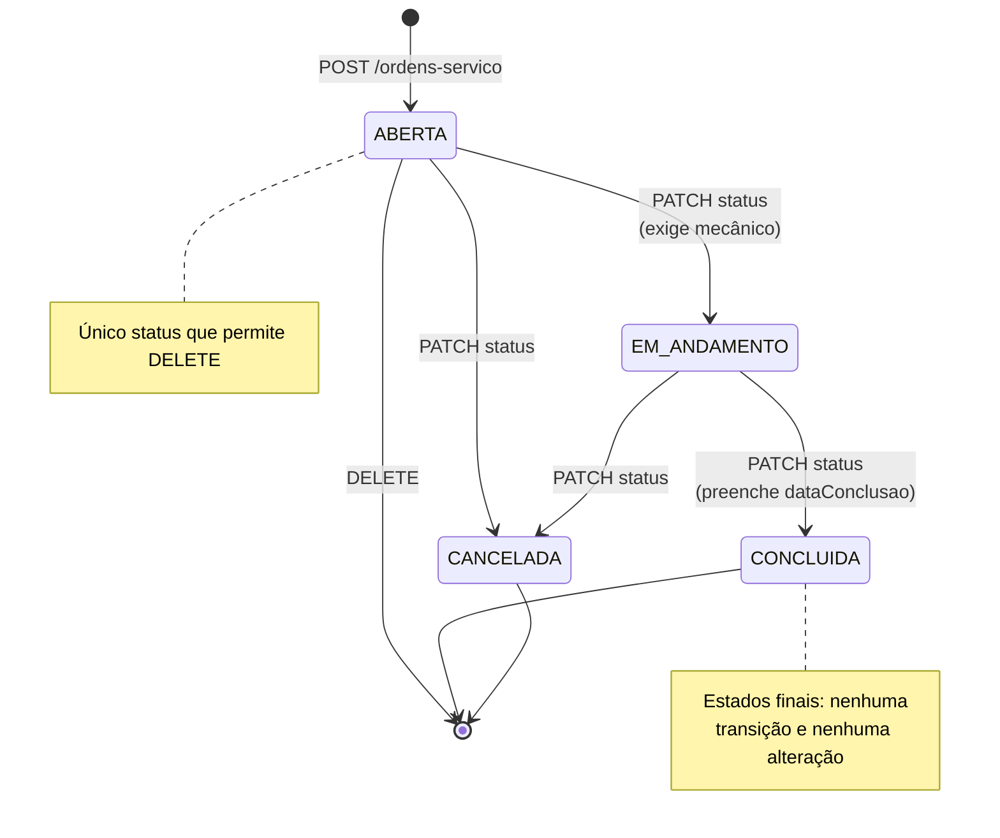

# Endpoints — Ordens de Serviço

Recurso central da oficina: registra o atendimento de um veículo, os serviços
executados e o valor cobrado. Todas as respostas de erro seguem o padrão
descrito em [`../erros.md`](../erros.md). Os exemplos usam os dados do seed
(`npm run db:seed`).

> **Requer autenticação:** todas as rotas desta página exigem o header
> `Authorization: Bearer <token>`. Veja [`../autenticacao.md`](../autenticacao.md)
> para obter o token.

| Método | URL                              | Objetivo resumido                           |
| ------ | -------------------------------- | ------------------------------------------- |
| GET    | `/ordens-servico`                | Lista paginada com filtros                  |
| GET    | `/ordens-servico/{id}`           | Detalhe completo com itens e subtotais      |
| POST   | `/ordens-servico`                | Abre uma ordem de serviço                   |
| PUT    | `/ordens-servico/{id}`           | Substitui os campos editáveis e os itens    |
| PATCH  | `/ordens-servico/{id}/status`    | Avança o ciclo de vida                      |
| DELETE | `/ordens-servico/{id}`           | Exclui uma ordem ainda não iniciada         |

Endpoints de relacionamento (documentados no recurso pai):
[`GET /veiculos/{id}/ordens-servico`](./veiculos.md),
[`GET /mecanicos/{id}/ordens-servico`](./mecanicos.md) e
[`GET /clientes/{id}/ordens-servico`](./clientes.md).

---

## Ciclo de vida



A máquina de estados vive em um único arquivo —
[`src/modules/ordens-servico/transicoes-status.ts`](../../src/modules/ordens-servico/transicoes-status.ts) —
com funções puras cobertas por testes na matriz completa 4×4.

### O que cada status permite

| Status         | Alterar (PUT) | Trocar itens | Excluir (DELETE) | Transições possíveis          |
| -------------- | ------------- | ------------ | ---------------- | ----------------------------- |
| `ABERTA`       | ✅            | ✅           | ✅               | `EM_ANDAMENTO`, `CANCELADA`   |
| `EM_ANDAMENTO` | ✅            | ✅           | ❌ (409)         | `CONCLUIDA`, `CANCELADA`      |
| `CONCLUIDA`    | ❌ (409)      | ❌ (409)     | ❌ (409)         | nenhuma (estado final)        |
| `CANCELADA`    | ❌ (409)      | ❌ (409)     | ❌ (409)         | nenhuma (estado final)        |

### Regras de negócio

| Regra | Comportamento |
| --- | --- |
| Status inicial | Toda ordem nasce `ABERTA`, com `dataAbertura` = instante da criação |
| Mecânico | Opcional na abertura; **obrigatório** para ir a `EM_ANDAMENTO` ou `CONCLUIDA` |
| Mecânico inativo | Não pode receber ordens (409). Manter um mecânico que foi desativado **depois** de ser atribuído é permitido |
| Serviço inativo | Não pode ser lançado em uma ordem (409). Um serviço desativado depois de entrar na ordem continua lá e pode ser mantido no PUT |
| `precoUnitario` | Copiado do catálogo **pelo servidor**; nunca vem na requisição. Reajustes posteriores no serviço não alteram ordens existentes |
| `subtotal` | `quantidade × precoUnitario`, calculado na resposta e não armazenado |
| `valorTotal` | Soma dos subtotais, recalculada e gravada a cada mudança de itens, com aritmética decimal exata |
| Veículo | Definido na abertura e **imutável**: `veiculoId` não existe no corpo do PUT |
| `dataConclusao` | Preenchida somente na transição para `CONCLUIDA` |
| Exclusão | Apenas em `ABERTA`; os itens saem em cascata. Ordens iniciadas devem ser encerradas com `CANCELADA` |
| Atomicidade | Toda escrita que envolve ordem + itens roda em uma transação: falha de validação não deixa dados pela metade |

---

### GET /ordens-servico

**Objetivo:** listar as ordens de serviço no formato resumido, da mais recente para a mais antiga, com filtros combináveis.

**Parâmetros de rota / consulta:**

| Nome          | Tipo    | Obrigatório | Finalidade                                                                                          |
| ------------- | ------- | ----------- | --------------------------------------------------------------------------------------------------- |
| `status`      | string  | não         | Um ou mais status separados por vírgula (`ABERTA,EM_ANDAMENTO`). Valores exatos do enum; qualquer outro → 400 |
| `veiculo_id`  | integer | não         | Restringe às ordens de um veículo                                                                    |
| `mecanico_id` | integer | não         | Restringe às ordens atribuídas a um mecânico                                                         |
| `cliente_id`  | integer | não         | Restringe às ordens de **todos os veículos** de um cliente                                           |
| `data_inicio` | string  | não         | Data inicial de abertura (`YYYY-MM-DD`), **inclusiva**, interpretada em **UTC** a partir de `00:00:00.000Z` |
| `data_fim`    | string  | não         | Data final de abertura (`YYYY-MM-DD`), **inclusiva**, interpretada em **UTC** até `23:59:59.999Z`     |
| `page`        | integer | não         | Página desejada, começando em 1 (padrão `1`)                                                         |
| `limit`       | integer | não         | Registros por página, de 1 a 100 (padrão `10`)                                                       |

> As datas são interpretadas **em UTC**, não no fuso do servidor nem do cliente:
> `data_inicio=2026-03-01&data_fim=2026-03-31` cobre de `2026-03-01T00:00:00.000Z`
> a `2026-03-31T23:59:59.999Z`. Uma ordem aberta às `23:30Z` de 31/03 entra no
> resultado; uma aberta à `00:10Z` de 01/04 não.

**JSON enviado:** Não possui corpo.

**Resposta de sucesso:** `200 OK`

```json
{
  "page": 1,
  "limit": 10,
  "total": 30,
  "data": [
    {
      "id": 30,
      "status": "ABERTA",
      "dataAbertura": "2026-09-28T12:00:00.000Z",
      "dataConclusao": null,
      "valorTotal": 558.9,
      "veiculo": { "id": 27, "placa": "EFH2M89", "modelo": "City EX 1.5" },
      "mecanico": null
    },
    {
      "id": 22,
      "status": "CONCLUIDA",
      "dataAbertura": "2026-08-31T12:00:00.000Z",
      "dataConclusao": "2026-09-03T12:00:00.000Z",
      "valorTotal": 95,
      "veiculo": { "id": 11, "placa": "EFG1122", "modelo": "Polo Highline 1.0" },
      "mecanico": { "id": 3, "nome": "Ivone Salgado" }
    }
  ]
}
```

O formato resumido **não** inclui `descricaoProblema`, `observacoes` nem `itens`
— use o detalhe para isso. Uma página além do total devolve `200` com `"data": []`.

**Respostas de erro:**

| HTTP | Código de erro    | Quando ocorre                                                                            |
| ---- | ----------------- | ---------------------------------------------------------------------------------------- |
| 400  | `DADOS_INVALIDOS` | `status` com valor fora do enum; datas fora de `YYYY-MM-DD`; `data_inicio` maior que `data_fim`; ids não numéricos; `page`/`limit` fora da faixa |

---

### GET /ordens-servico/{id}

**Objetivo:** obter o detalhe completo de uma ordem: veículo com o proprietário, mecânico, itens com preço e subtotal, e o valor total.

**Parâmetros de rota / consulta:**

| Nome | Tipo    | Obrigatório | Finalidade                   |
| ---- | ------- | ----------- | ---------------------------- |
| `id` | integer | sim (rota)  | Id da ordem a ser consultada |

**JSON enviado:** Não possui corpo.

**Resposta de sucesso:** `200 OK`

```json
{
  "id": 1,
  "status": "CONCLUIDA",
  "descricaoProblema": "Barulho no motor ao acelerar em subida.",
  "observacoes": "Cliente autorizou a troca do filtro por telefone.",
  "dataAbertura": "2026-04-03T12:00:00.000Z",
  "dataConclusao": "2026-04-05T12:00:00.000Z",
  "valorTotal": 284.9,
  "veiculo": {
    "id": 1,
    "placa": "ABC1234",
    "marca": "Fiat",
    "modelo": "Argo Drive 1.0",
    "cliente": { "id": 3, "nome": "Carla Menezes Duarte", "telefone": "47993034455" }
  },
  "mecanico": { "id": 1, "nome": "Adilson Moita", "especialidade": "Motor e injecao eletronica" },
  "itens": [
    {
      "id": 1,
      "servico": { "id": 1, "descricao": "Troca de oleo e filtro" },
      "quantidade": 1,
      "precoUnitario": 189.9,
      "subtotal": 189.9
    },
    {
      "id": 2,
      "servico": { "id": 7, "descricao": "Diagnostico eletronico completo" },
      "quantidade": 1,
      "precoUnitario": 95,
      "subtotal": 95
    }
  ],
  "createdAt": "2026-09-28T23:39:17.348Z",
  "updatedAt": "2026-09-28T23:39:17.348Z"
}
```

**Respostas de erro:**

| HTTP | Código de erro           | Quando ocorre                       |
| ---- | ------------------------ | ----------------------------------- |
| 400  | `DADOS_INVALIDOS`        | `id` não é um inteiro positivo      |
| 404  | `RECURSO_NAO_ENCONTRADO` | Não existe ordem com o id informado |

---

### POST /ordens-servico

**Objetivo:** abrir uma ordem de serviço para um veículo, com os serviços a executar.

**Parâmetros de rota / consulta:** Não possui.

**JSON enviado:**

```json
{
  "veiculoId": 1,
  "mecanicoId": 1,
  "descricaoProblema": "Motor perdendo potencia e consumo alto de combustivel.",
  "observacoes": "Cliente relata que comecou depois de abastecer fora da cidade.",
  "itens": [
    { "servicoId": 1, "quantidade": 1 },
    { "servicoId": 7, "quantidade": 1 }
  ]
}
```

Regras de entrada: `veiculoId` obrigatório; `mecanicoId` opcional; `descricaoProblema`
de 5 a 500 caracteres; `observacoes` opcional com até 1000; `itens` com **pelo
menos um** elemento, `quantidade` de 1 a 99 e **sem repetir `servicoId`**.
`status`, `valorTotal`, `dataAbertura`, `dataConclusao` e `precoUnitario` são
controlados pelo servidor — enviá-los resulta em **400**.

**Resposta de sucesso:** `201 Created` — corpo no formato do detalhe, com
`status: "ABERTA"`, `dataAbertura` = agora e `valorTotal` já somado.

**Respostas de erro:**

| HTTP | Código de erro           | Quando ocorre                                                                       |
| ---- | ------------------------ | ----------------------------------------------------------------------------------- |
| 400  | `DADOS_INVALIDOS`        | Campo ausente ou inválido, lista de itens vazia, `servicoId` repetido, campo não declarado no DTO |
| 400  | `JSON_INVALIDO`          | O corpo não é um JSON válido                                                        |
| 404  | `RECURSO_NAO_ENCONTRADO` | Veículo, mecânico ou serviço inexistente — a mensagem identifica qual               |
| 409  | `OPERACAO_NAO_PERMITIDA` | Mecânico inativo ou serviço inativo                                                 |

---

### PUT /ordens-servico/{id}

**Objetivo:** substituir os campos editáveis e a lista de itens de uma ordem em andamento ou recém-aberta.

**Parâmetros de rota / consulta:**

| Nome | Tipo    | Obrigatório | Finalidade                  |
| ---- | ------- | ----------- | --------------------------- |
| `id` | integer | sim (rota)  | Id da ordem a ser alterada  |

**JSON enviado:**

```json
{
  "mecanicoId": 1,
  "descricaoProblema": "Motor perdendo potencia e consumo alto de combustivel.",
  "observacoes": "Diagnostico apontou bicos injetores sujos.",
  "itens": [
    { "servicoId": 1, "quantidade": 1 },
    { "servicoId": 7, "quantidade": 1 },
    { "servicoId": 2, "quantidade": 1 }
  ]
}
```

> **`veiculoId` não faz parte do corpo.** O veículo de uma ordem é imutável —
> enviá-lo gera **400** (`forbidNonWhitelisted`). Para atender outro veículo,
> abra uma nova ordem.

Substituição de itens:

- serviço que **já estava** na ordem mantém o `precoUnitario` original, mesmo
  que tenha sido reajustado ou desativado no catálogo depois;
- serviço **novo** entra com o preço atual e precisa estar **ativo**;
- serviço omitido é removido da ordem;
- `mecanicoId: null` desatribui o mecânico.

**Resposta de sucesso:** `200 OK` — corpo no formato do detalhe, com `valorTotal` recalculado.

**Respostas de erro:**

| HTTP | Código de erro           | Quando ocorre                                                             |
| ---- | ------------------------ | ------------------------------------------------------------------------- |
| 400  | `DADOS_INVALIDOS`        | `id` inválido, payload incompleto/inválido, `servicoId` repetido, `veiculoId` enviado |
| 400  | `JSON_INVALIDO`          | O corpo não é um JSON válido                                              |
| 404  | `RECURSO_NAO_ENCONTRADO` | Ordem, mecânico ou serviço inexistente                                    |
| 409  | `OPERACAO_NAO_PERMITIDA` | Ordem em estado final (`CONCLUIDA`/`CANCELADA`), mecânico inativo novo, ou serviço inativo novo |

---

### PATCH /ordens-servico/{id}/status

**Objetivo:** avançar a ordem no ciclo de vida. É o único jeito de iniciar, concluir ou cancelar uma ordem.

**Parâmetros de rota / consulta:**

| Nome | Tipo    | Obrigatório | Finalidade                    |
| ---- | ------- | ----------- | ----------------------------- |
| `id` | integer | sim (rota)  | Id da ordem a ser transicionada |

**JSON enviado:**

```json
{ "status": "EM_ANDAMENTO" }
```

**Resposta de sucesso:** `200 OK` — corpo no formato do detalhe. Na transição para
`CONCLUIDA`, `dataConclusao` recebe o instante atual.

**Respostas de erro:**

| HTTP | Código de erro           | Quando ocorre                                                                  |
| ---- | ------------------------ | ------------------------------------------------------------------------------ |
| 400  | `DADOS_INVALIDOS`        | `id` inválido ou `status` fora do enum                                          |
| 404  | `RECURSO_NAO_ENCONTRADO` | Não existe ordem com o id informado                                            |
| 409  | `OPERACAO_NAO_PERMITIDA` | Transição não permitida; ordem em estado final; ou destino exige mecânico e a ordem não tem nenhum atribuído |

```json
{
  "status": 409,
  "erro": "OPERACAO_NAO_PERMITIDA",
  "mensagem": "Transição de status inválida: ABERTA → CONCLUIDA."
}
```

---

### DELETE /ordens-servico/{id}

**Objetivo:** excluir uma ordem que ainda não começou a ser executada. Os itens saem em cascata.

**Parâmetros de rota / consulta:**

| Nome | Tipo    | Obrigatório | Finalidade                 |
| ---- | ------- | ----------- | -------------------------- |
| `id` | integer | sim (rota)  | Id da ordem a ser excluída |

**JSON enviado:** Não possui corpo.

**Resposta de sucesso:** `204 No Content` — sem corpo.

**Respostas de erro:**

| HTTP | Código de erro           | Quando ocorre                                                     |
| ---- | ------------------------ | ----------------------------------------------------------------- |
| 400  | `DADOS_INVALIDOS`        | `id` não é um inteiro positivo                                    |
| 404  | `RECURSO_NAO_ENCONTRADO` | Não existe ordem com o id informado                               |
| 409  | `OPERACAO_NAO_PERMITIDA` | A ordem não está `ABERTA` — a mensagem orienta o cancelamento      |

```json
{
  "status": 409,
  "erro": "OPERACAO_NAO_PERMITIDA",
  "mensagem": "Só é possível excluir uma ordem de serviço com status ABERTA, e esta está EM_ANDAMENTO. Para encerrá-la sem execução, use PATCH /ordens-servico/12/status com CANCELADA."
}
```
