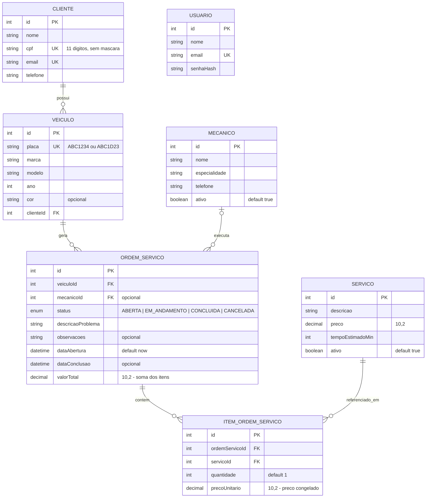

# Modelo de dados

Modelo de dados da API da oficina mecânica, implementado em
[`prisma/schema.prisma`](../prisma/schema.prisma) e criado no banco pela
migration `init`.

Convenções aplicadas em todas as entidades:

- `id` inteiro com `autoincrement()`;
- `createdAt` (`created_at`) e `updatedAt` (`updated_at`) em todos os modelos;
- models em PascalCase e campos em camelCase no Prisma, tabelas no plural e
  colunas em snake_case no banco, via `@@map` / `@map`;
- valores monetários em `Decimal(10,2)`.

## Diagrama ER

`USUARIO` aparece isolado de propósito: é a entidade de acesso à API, usada na
etapa de autenticação, e não se relaciona com as entidades de negócio.

## Relacionamentos

| Relacionamento                     | Cardinalidade | Como é representado                                        |
| ---------------------------------- | ------------- | ---------------------------------------------------------- |
| `Cliente` → `Veiculo`              | **1:N**       | `Veiculo.clienteId` (obrigatório)                          |
| `Veiculo` → `OrdemServico`         | **1:N**       | `OrdemServico.veiculoId` (obrigatório)                     |
| `Mecanico` → `OrdemServico`        | **1:N**       | `OrdemServico.mecanicoId` (**opcional**)                   |
| `OrdemServico` ↔ `Servico`         | **N:N**       | tabela de junção `ItemOrdemServico`                        |

Observações:

- `mecanicoId` é opcional porque uma ordem nasce **ABERTA** e só depois é
  distribuída para um mecânico.
- A junção `ItemOrdemServico` tem `@@unique([ordemServicoId, servicoId])`: o
  mesmo serviço não pode ser lançado duas vezes na mesma ordem — para repetir,
  usa-se `quantidade`.
- Um cliente pode existir sem veículos e um veículo pode existir sem ordens de
  serviço; o seed cobre esses casos de propósito.

## Regras de exclusão

| Relação                        | Regra      | Efeito                                                                    |
| ------------------------------ | ---------- | ------------------------------------------------------------------------- |
| `Veiculo` → `Cliente`          | `Restrict` | não é possível excluir um cliente que ainda tenha veículos                |
| `OrdemServico` → `Veiculo`     | `Restrict` | não é possível excluir um veículo com histórico de ordens de serviço      |
| `OrdemServico` → `Mecanico`    | `Restrict` | não é possível excluir um mecânico com ordens vinculadas                  |
| `ItemOrdemServico` → `Servico` | `Restrict` | não é possível excluir um serviço já lançado em alguma ordem              |
| `ItemOrdemServico` → `OrdemServico` | `Cascade` | excluir uma ordem de serviço apaga automaticamente os seus itens      |

O padrão é **`Restrict`** porque essas entidades formam o histórico da oficina:
apagar um cliente, um veículo, um mecânico ou um serviço em cascata destruiria
ordens de serviço já faturadas. Na API, a tentativa de exclusão bloqueada chega
como o erro `P2003` do Prisma e é traduzida para **409 Conflict**, orientando o
consumidor a desativar o registro (`ativo = false`, em mecânicos e serviços) em
vez de excluí-lo.

A única exceção é `OrdemServico` → `ItemOrdemServico`, com **`Cascade`**: o item
é parte da ordem e não tem significado sozinho, então ele acompanha a exclusão
da ordem que o contém.

## Por que o item guarda `precoUnitario`

`ItemOrdemServico.precoUnitario` é uma **cópia do preço do serviço no momento em
que o item foi incluído** na ordem, e não uma leitura de `Servico.preco`.

O catálogo de serviços é reajustado com o tempo. Se o valor do item fosse lido
do catálogo, um reajuste reescreveria retroativamente o valor de todas as ordens
antigas — inclusive das já concluídas e cobradas do cliente. Congelando o preço
no item:

- `valorTotal` da ordem permanece igual à soma de `quantidade × precoUnitario`
  dos seus itens, e continua auditável anos depois;
- o histórico mostra quanto foi efetivamente cobrado, não quanto o serviço custa
  hoje;
- o catálogo pode ser reajustado livremente sem efeito sobre ordens passadas.

É o mesmo motivo pelo qual um item de nota fiscal guarda o preço praticado na
venda em vez de apontar para a tabela de preços vigente.
